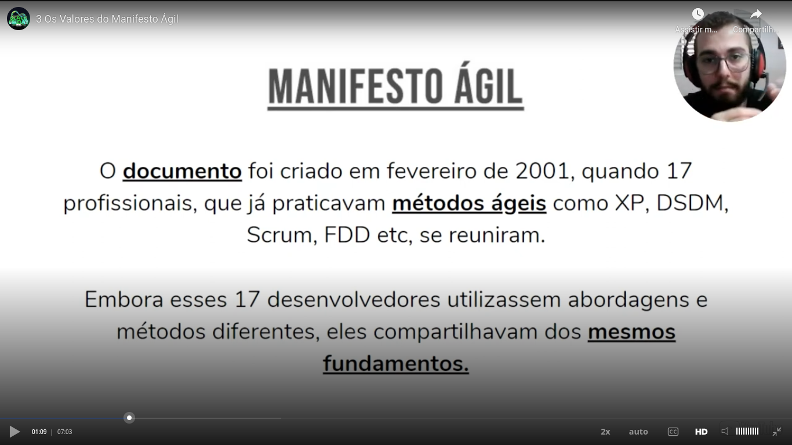
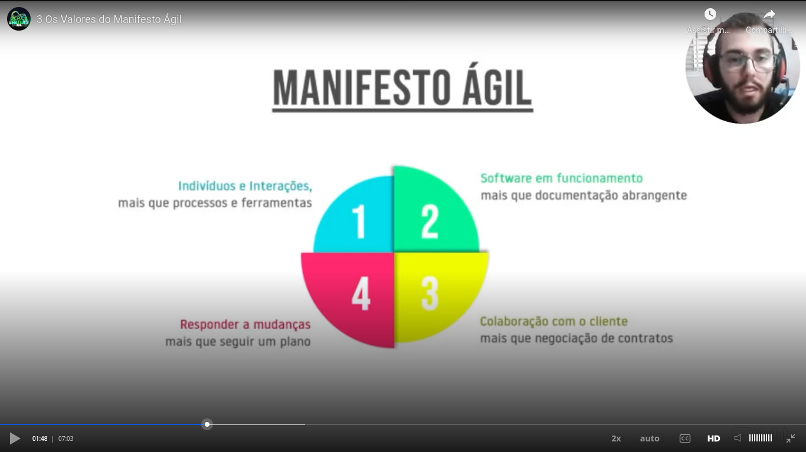

# General

The presentetion that teacher used can be found [here (private link) - respecting copyright](https://drive.google.com/file/d/1HH2cKc2CMhqw7iigsA7tA0A08wCkxfbI/view?usp=drive_link)

Teacher commented that being agile is different than being quick. In his ludic example he compared a guepardo to a bullet train. The bullet trains are more quick, but cheetah is more agile, as he can adopt better to new scenarios.

A quick team tend to involve problem, be running to crazy deadlines, communication problems and other problems. In other hand, an agile team tend ti be better in achieve goals.

Characteristics of an agile team:
- Better and efficient communication;
- Work as a team;
- Be conscious of the flow of the jobs;
- Work with focus;
- To validate if the path is right;
- To aim the continuous improvement.

## Agile manifest

### Values

### Principles

## Characteristics of an agile team

## Importance of agile in the technology world

Key points:

- Innovation;
- Quick delivery (quick, but things that have a high value aggregated);
- Efficience.

### Vuca

## Process x project

## Agile x waterfall

In a waterfall model, the value aggregated to the project can be saw only at the end of the project.

In an agile model, at the end of each sprint you can delivery a part of the product that has a value aggregated.

A thing that is very important in Scrum (example of agile model) is that at the end of each iteration (sprint) you have a feedback and can adjust the product.

In some contexts it was adopted a hybrid model, with some characteristics of waterfall and some characteristics of agile.

## Characteristics of agile management

## Scrum

Bases of Scrum:

- empiricism;
- lean thinking.

In relation to empiricism, teacher talked about **PDCA**:
- *P*: plan;
- *D*: do;
- *C*: check;
- *A*: act.

### Scrum pilars

TIA:
- **T**ransparency;
- **I**nspection;
- **A**daptation.

### Scrum framework

Remember: Scrum is a **framework**. It says:

- Why needs to be done;
- What needs to be done;
- But do not defines how to do it. In this point a methodology has a recipe related to how to do it.

## Extreme programming

Teacher showed a slide similar of a PDCA cycle, with the steps:

- **P**: plan;
- **D**: do;
- **T**: test;
- **I**: impove / do an increment.

**Pair programming** is a thing that exists in "XP world".

### Summary of XP

## Kanban

### Definition

Initially defined by Toyota, initially Kanban borned to solve a problem related stock of products:

- If you have a big stock, means that your products are not in the market;
- If you have a lower stock, means that you can't supply the demand.

### Explanation

Teacher said that the original columns of a Kanban board ("to do", "did", "done") are expanded in some case. It is depends on the necessity.

### Curiosity

- **K**anban (uppercase "K"): method;
- **k**anban (lowercase "k"): japanese word that means "card".

## OKR

OKR = **O**bjective **K**ey **R**esults

For more information, please see the slides from 50 to 58 of the [presentation related to the course](https://drive.google.com/file/d/1HH2cKc2CMhqw7iigsA7tA0A08wCkxfbI/view?usp=drive_link), please.

Observation: NPS = customer satisfaction index. Teacher commented that 80% is a good level of NPS.

Teacher do not commented about a fixed deadline to achieve a key point In other words: in the examples you have the objective and the key result, but you don't have a fixeddeadline to achieve the key result. it depends of each case. Is normal that the deadline not to be too short because the objective is strategic.

Curiosity: OKR have 3 words, but is related only to 2 things, see:
- **O**bjective;
- **K**ey **R**esults - only 1 thing
 
 Is normal (not a rule) to have 2 to 5 key results for each objective.

 OKR is also fundamented on the principles of agile methods.

The things in OKR are not fixed. If you define in the beggining of the year an objective to achieve in the end of the year, you can change the objective in the middle of the year if you see that is not possible to achieve such an objective.

## Useful related links

Please see the [presentation related to the course](https://drive.google.com/file/d/1HH2cKc2CMhqw7iigsA7tA0A08wCkxfbI/view?usp=drive_link), please.