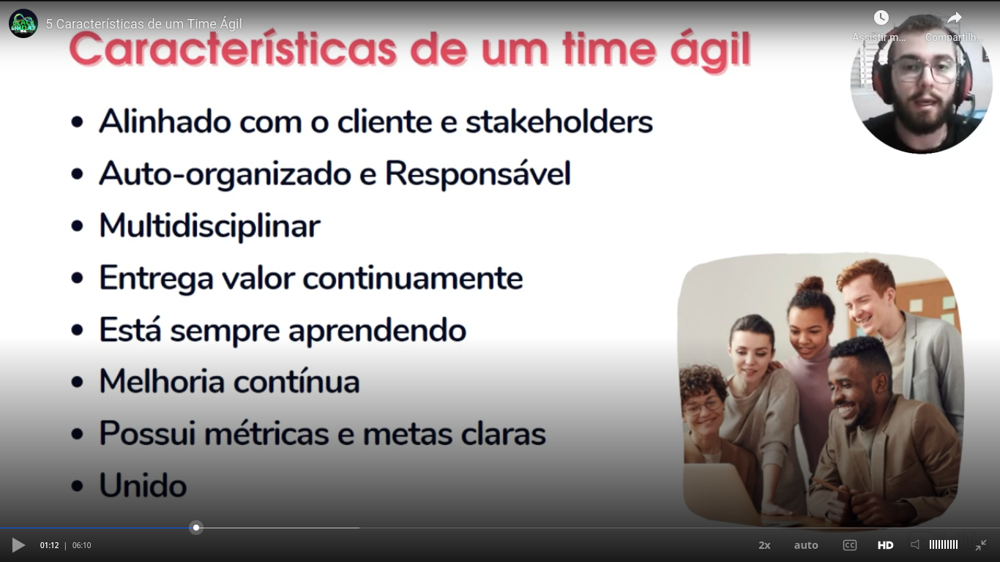

# General

Teacher commented that being agile is different than being quick. In his ludic example he compared a guepardo to a bullet train. The bullet trains are more quick, but cheetah is more agile, as he can adopt better to new scenarios.

A quick team tend to involve problem, be running to crazy deadlines, communication problems and other problems. In other hand, an agile team tend ti be better in achieve goals.

Characteristics of an agile team:
- Better and efficient communication;
- Work as a team;
- Be conscious of the flow of the jobs;
- Work with focus;
- To validate if the path is right;
- To aim the continuous improvement.

## Agile manifest

### Values

### Principles

## Characteristics of an agile team

## Importance of agile in the technology world

Key points:

- Innovation;
- Quick delivery (quick, but things that have a high value aggregated);
- Efficience.

### Vuca

## Process x project

## Agile x waterfall

In a waterfall model, the value aggregated to the project can be saw only at the end of the project.

In an agile model, at the end of each sprint you can delivery a part of the product that has a value aggregated.

A thing that is very important in Scrum (example of agile model) is that at the end of each iteration (sprint) you have a feedback and can adjust the product.

In some contexts it was adopted a hybrid model, with some characteristics of waterfall and some characteristics of agile.

## Characteristics of agile management

## Scrum

Bases of Scrum:

- empiricism;
- lean thinking.

In relation to empiricism, teacher talked about **PDCA**:
- *P*: plan;
- *D*: do;
- *C*: check;
- *A*: act.

### Scrum pilars

TIA:
- **T**ransparency;
- **I**nspection;
- **A**daptation.